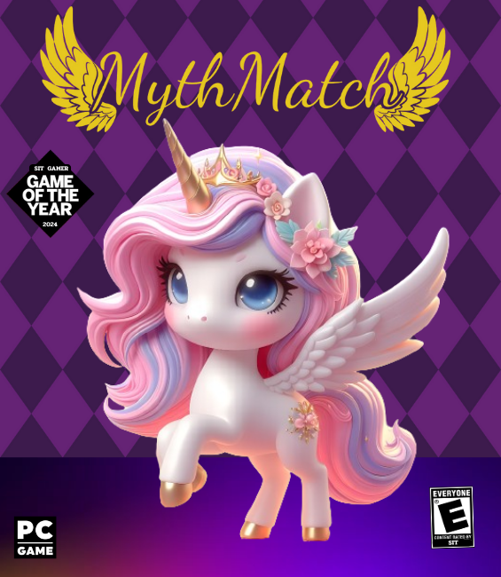

<div align="center">
  <h2 style="font-size:24px;">Section 2 <br>
  Team Point of Vue</h2>
</div>

<!--  -->
<div align="center">

<p align = "left">Lorem Ipsum is simply dummy text of the printing and typesetting industry. Lorem Ipsum has been the industry's standard dummy text ever since the 1500s, when an unknown printer took a galley of type and scrambled it to make a type specimen book. It has survived not only five centuries, but also the leap into electronic typesetting, remaining essentially unchanged. It was popularised in the 1960s with the release of Letraset sheets containing Lorem Ipsum passages, and more recently with desktop publishing software like Aldus PageMaker including versions of Lorem Ipsum.</p>

</div>

<div align = "center">
  <h2 style="font-size:24px;">See Progress</h2>
<a src = "https://www.figma.com/file/MyTwZilN3k5pQ2qYkS5Fnz/%E0%B8%88%E0%B8%B1%E0%B8%9A%E0%B8%84%E0%B8%B9%E0%B9%88%E0%B8%A0%E0%B8%B2%E0%B8%9E?type=design&node-id=0%3A1&mode=design&t=nKgaOcYl7VrjEUzM-1">
Figma
</a>
</div>
<div>


</div>
<div>

<h1 align = "center">Team Member</h1>
<h4 align >

65130500080 SIRIWAN HOSAREE

</h4>

<h4 align >

65130500084 SITTHA MANITTAYAKUL

</h4>
<h4 align >

65130500089 AKKARAWIT SITTIPRAKAN


</h4>
<h4 align >

65130500108 BUNYAKORN PORNSOMBATPAIBOOL


</h4>
<h4 align >

65130500114 METHUS DUMRONGMONGKHOLKUL

</h4>

</div>


### Install package

```sh
npm install
```

### Compile for Development

```sh
npm run dev
```

### Compile and Minify for Production

```sh
npm run build
```
