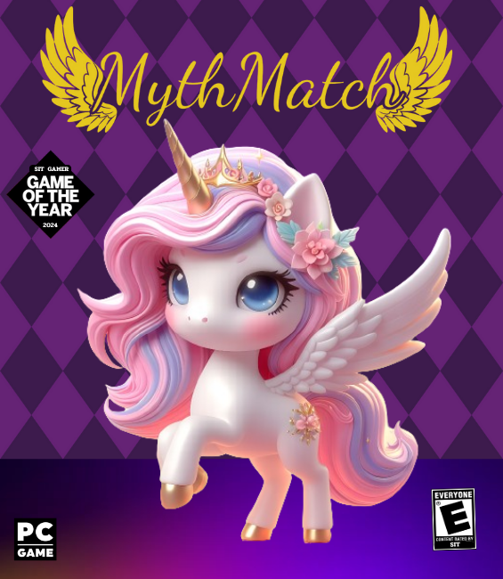
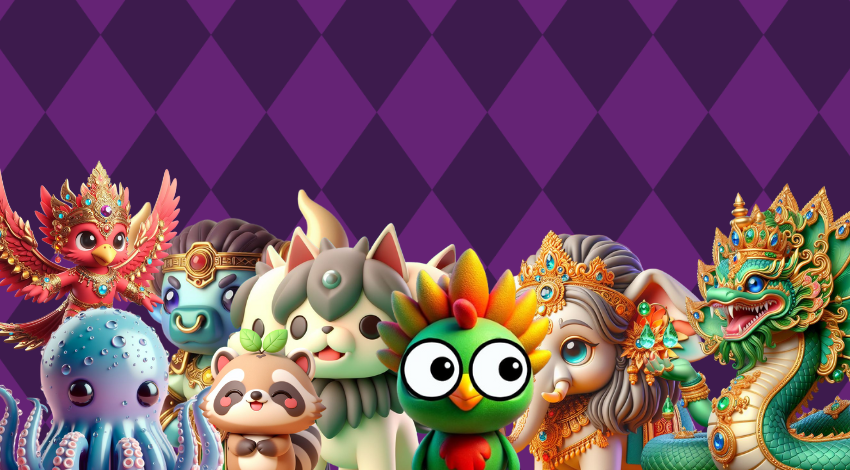

<div align="center">
  <h1 style="font-size:24px;">Section 2 <br>
  Team Point of Vue</h1>
</div>

<!--  -->
<div align="center">

</div>

<h1 align = "center">Team Member</h1>

<div align="center">
<table>
<thead>
<tr>
<th width="">Student ID</th>
<th width="">Member name</th>
<th width="30%">Contribution</th>
<th width="">Contribution Rate</th>
<th width=""></th>
</tr>
</thead>
<tbody>
<tr>
<td>65130500080</td>
<td><b>SIRIWAN HOSAREE</b></td>
<td>
  <ul>
  <li>Leader board</li>
  <li>Challenge mode: Combo</li>
  <li>Class Board</li>
  <li>Loading screen: Random card</li>
  <li>Versus mode algorithm</li>
  </ul>
</td>
<td>
  16.67%
</td>
<td></td>
</tr>
<tr>
<td>65130500084</td>
<td><b>SITTHA MANITTAYAKUL</b></td>
<td>
<ul>
<li>Responsive UI design</li>
<li>Challenge mode algorithm</li>
<li>Graphic design</li>
<li>Code review</li>
<li>Sound system</li>
<li>Game infrastructure</li>
</ul>
</td>
<td>30%</td>
<td></td>
</tr>
<tr>
<td>65130500089</td>
<td><b>AKKARAWIT SITTIPRAKAN</b></td>
<td>
<ul>
<li>Animation Logo
</li>
<li>Quality Setting</li>
<li>Refactor to oop phase 1</li>
<li>Encryption</li>
<li>Save setting to localStorage</li>
<li>Generate AI image</li>
<li>Find sound assets</li>
<li>Readme</li>
<li>Misc. helper</li>
</ul>
</td>
<td>
  20%
</td>
<td></td>
</tr>
<tr>
<td>65130500108</td>
<td><b>BUNYAKORN PORNSOMBATPAIBOOL</b></td>
<td>
<ul>
<li>Versus mode responsive UI</li>
<li>Challenge mode player responsive UI</li>
<li>Versus mode algorithm: Timer</li>
</ul>
</td>
<td>16.67%</td>
<td></td>
</tr>
<tr>
<td>65130500114</td>
<td><b>METHUS DUMRONGMONGKHOLKUL</b></td>
<td>
<ul>
<li>Encryption</li>
<li>Generate AI image</li>
<li>Shuffle algorithm</li>
<li>Write how to play</li>
</ul>
</td>
<td>16.66%</td>
<td></td>
</tr>
</tbody>
</table>
</div>


<hr>
<br>

<h1 align="center">Feature</h1>

<div>
  <div align="center" >
    
  </div>
  
  <h2>Manual</h2>
  <table align="center" >
    <tbody>
      <tr>
        <td></td>
        <td>Player can open and read how to play directly at book icon button in landing page</td>
      </tr>
    </tbody>
  </table>

  <h2>Setting Option</h2>
  <table align="center" >
    <tbody>
      <tr>
        <td></td>
        <td>Player have option to setting sound volume (music and sound effect) and game quality</td>
      </tr>
    </tbody>
  </table>
  
  <h2>Mode Selection</h2>
  <table align="center" >
    <tbody>
      <tr>
        <td></td>
        <td>Our game have 2 mode those is "Challenge Mode" and "Versus Mode"</td>
      </tr>
    </tbody>
  </table>

  <h2>Challenge Mode (Single player)</h2>
  <table align="center" >
    <tbody>
      <tr>
        <td></td>
        <td>
          Challenge mode will challenge the player who want to be the top of leader board
          <ul>
            <li>Timer: more focus before time run out</li>
            <li>Leader board: all of the player scores have been saved, and the leader board will show your rank in realtime.</li>
            <li>Combo Streak: continue to get the correct pair to get more point</li>
          </ul>
        </td>
      </tr>
      <tr>
        <td></td>
        <td>
          Match summarize in game over screen
        </td>
      </tr>
      <tr>
        <td></td>
        <td>
          Leader board data will encrypt and store in localStorage
        </td>
      </tr>
    </tbody>
  </table>

  <h2>Versus Mode (Two player)</h2>
  <table align="center" >
    <tbody>
      <tr>
        <td><br></td>
        <td>
          Versus mode will give oppotunity the player to challenge his/her friend or family to find the winner of memorization
        </td>
      </tr>
    </tbody>
  </table>

  <h2>Responsive Design</h2>
  <table align="center">
    <tbody>
      <tr>
        <td align="center"></td>
        <td>PC and Tablet</td>
      </tr>
      <tr>
        <td align="center"></td>
        <td>Mobile Horizontal</td>
      </tr>
      <tr>
        <td align="center"></td>
        <td>Mobile Vertical</td>
      </tr>
    </tbody>
  </table>
</div>

<hr>
<br>

<div align="center">
<h1>Game Manual</h1>
</div>
<blockquote>This game manual (in this README.md) as same as in game manual.</blockquote>
<h2>Unleash Your Memory Magic: Mastering Memory Match!</h2>
<p>Ready to test your memory and challenge your friends? Dive into the thrilling world of Memory Match! This guide will equip you with the knowledge to conquer both single-player and versus modes, turning you into a memory maestro.</p>

<h3>Table of Contents</h3>
<ul>
  <li>
    <a href="#challenge">
      Challenge Mode
    </a>
  </li>
  <ul>
    <li>
      <a href="#combo">
        Combo Power-Up!
      </a>
    </li>
  </ul>
  <li>
    <a href="#versus">
      Versus Mode
    </a>
  </li>
</ul>

<hr>

<h2 id="challenge">Challenge Mode: A Memory Match Marathon! (Single player)</h2>


<ol>
  <li><b>Picture Perfect Grid:</b> The game starts with a grid of cards, all facing down, hiding various pictures.</li>
  <li><b>Memory Mayhem:</b> Click on two cards to reveal their hidden images. Remember, it's a race against time!</li>
  <li><b>Match Made in Memory Heaven:</b> If the two cards are identical, they stay face up, and you score points (current level x <a href="#combo">combo</a>) and bonus time (+5 seconds).</li>
  <li><b>Memory Mishap:</b> Not an identical pair? No worries! Flip them back down and try again. Keep your focus sharp!</li>
  <li><b>Level Up!</b> Clear all pairs before time runs out, and you'll be whisked away to a new level, where your memory will be further challenged.
    
  
  
  </li>
  <li><b>Gridlock Alert!</b> If the board fills up (12 pairs), the tension rises with a red background. While you won't get extra time for correct matches, keep scoring those points!
  
  
  </li>

  <li><b>Time's Up!</b> When the clock strikes zero, the game ends, showcasing your score and ranking on the leader board. Did you become the memory champion?</li>
</ol>

<h3 id="combo">Combo Power-Up!</h3>


<p>The combo system is your secret weapon for racking up points. Here's how it works:</p>

<ul>
  <li><b>Double the Joy:</b> With each correct match, your combo increases (Combo x2, x3, and so on). This multiplies your points, making your memory prowess truly shine!</li>
  <li><b>Streak Saver:</b> Keep the correct matches coming, and your combo keeps climbing. But remember, a wrong match resets your combo, so stay focused!</li>
</ul>

<h2 id="versus">Versus Mode: Face-Off Fun! (Two player)</h2>


<p>Ready to challenge your friends? Versus mode is your battleground!</p>
<ol>
  <li><b>Randomized Rounds:</b> The game randomly picks who starts, indicated by the red side. Remember, the first one to strike wins the round!</li>
  <li><b>Your Turn to Shine:</b> On your turn, reveal two cards. Match them correctly, and you earn a point and keep going until you miss.</li>
  <li><b>Turnover Time:</b> Make a mistake, and your turn ends, passing the spotlight to your opponent.</li>
  <li><b>Memory Marathon:</b> Keep playing until all cards are flipped. The player with the highest score wins! But wait, there's a twist...</li>
  <li><b>Draw? No Problem!</b> If it's a tie, all cards flip back down, and the memory battle continues! The player with the most points after this second round is the ultimate memory champion.</li>
</ol>
<p>So, are you ready to embark on this exciting memory adventure? With these tips and tricks, you'll be a Memory Match master in no time!</p>

https://github.com/6MA-606/PROJECT1-SEC2-Point-of-Vue/assets/85861104/c03034a0-7197-4514-b9e9-c93d4f0175ff

<hr>
<br>

<div>
See our design in 
<a href="https://www.figma.com/file/MyTwZilN3k5pQ2qYkS5Fnz/%E0%B8%88%E0%B8%B1%E0%B8%9A%E0%B8%84%E0%B8%B9%E0%B9%88%E0%B8%A0%E0%B8%B2%E0%B8%9E?type=design&node-id=0%3A1&mode=design&t=nKgaOcYl7VrjEUzM-1"></a>
</div>
<br>

# References

- **Design**

    - [(W3School) How TO - Flip Card](https://www.w3schools.com/howto/howto_css_flip_card.asp)

    - [(Sikiri Dakua) Animated Cursor Interaction](https://codepen.io/dev_loop/pen/jOborLv)

- **Images**

    - Card Images
        - generated using [Open AI DALL·E 3](https://openai.com/dall-e-3) and [Recraft](https://www.recraft.ai/)

- **Sound Effects and Background Music**
    - BGM phase 1 -- [XtremeFreddy - Game Music Loop 1](https://pixabay.com/sound-effects/game-music-loop-1-143979/)
    - BGM phase 2 -- [Pixabay - gameMusic](https://pixabay.com/sound-effects/gamemusic-6082/)
    - BGM phase 3 -- [Pixabay - Video game music loop](https://pixabay.com/sound-effects/video-game-music-loop-27629/)
    - BGM Multiplayer -- [White_Records - Energetic background reggaeton short music 27 sec. Fun vlog music](https://pixabay.com/music/urban-latin-energetic-background-reggaeton-short-music-27-sec-fun-vlog-music-149384/)
    -  flipcard sound -- [ukhf - Deepwoken Talent Card Flip Sound Effect](https://www.youtube.com/watch?si=itx_puiOXHRARMJV&v=BmLJ60owkX8&feature=youtu.be)
    -  Point gain effect -- [Liecio - Collect Points](https://pixabay.com/sound-effects/collect-points-190037/)

<br>
<br>


### Install package

```sh
npm install
```

### Compile for Development

```sh
npm run dev
```

### Compile and Minify for Production

```sh
npm run build
```
